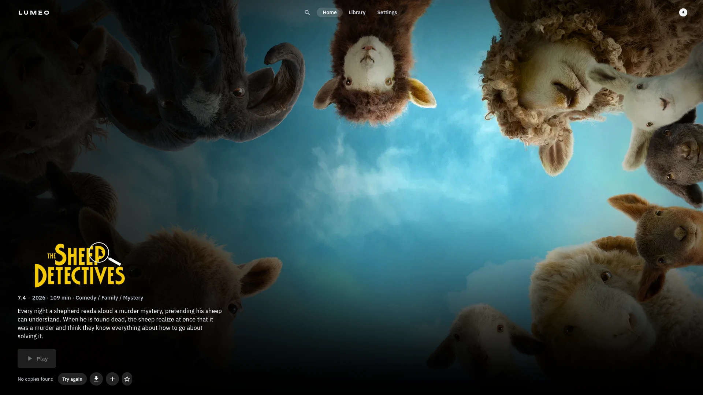
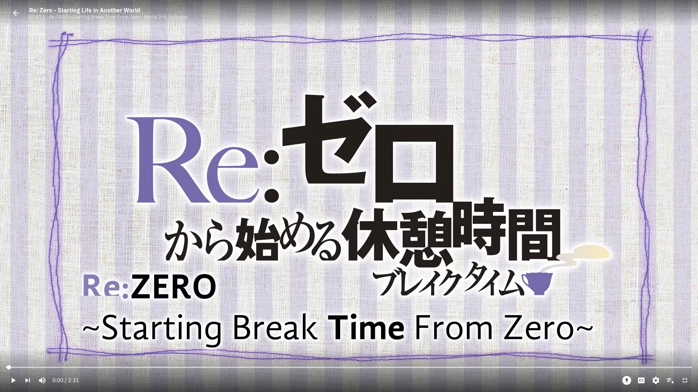

# Lumeo

Films and series on Linux and Windows: pick a title, start watching while it downloads.

## Install

Take the file for your system from the latest release.

    sudo dnf install ./lumeo-<version>-1.fc44.x86_64.rpm          # Fedora
    sudo pacman -U ./lumeo-<version>-1-x86_64.pkg.tar.zst         # Arch

Elsewhere on Linux, unpack the tarball, install your distribution's libmpv and run `lumeo.sh`.
On Windows 10 and 11, run the setup `.exe`; it is not signed yet, so SmartScreen asks first
("More info", then "Run anyway").

## Sources

Lumeo hosts and indexes nothing. Catalogue, sources and subtitles come from
[Stremio addons](https://github.com/Stremio/stremio-addon-sdk) you choose under Settings →
Sources. Lumeo starts with a catalogue and subtitles; the addon it plays from is yours to add. What
you watch with them is your responsibility.

## Development

A Go core with SQLite and a Flutter client that plays through libmpv; `client/tool/dev.sh start`
runs both. [CONTRIBUTING.md](CONTRIBUTING.md) has the setup and the checks; see also
[architecture](docs/architecture.md), [decisions](docs/decisions/README.md),
[the core and its API](docs/core.md) and the [roadmap](docs/roadmap.md).

## License

[MIT](LICENSE)
